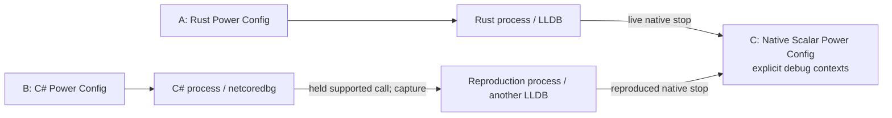

# Design question: Rust and C# sharing Native Scalar

**Status:** Follow-up proposal, 3 October 2026. No shared-consumer UI is
implemented by this document. Companion: [Rust native debugging](design-ldi-debugging-rust.md)
and [managed LDI](design-ldi-debugging.md).

The initial Rust live-native provider is now implemented, but intentionally
reserves one Native inspector for one owner and fences its native project from
rebuilds until Rust Debug ends. It rejects a conflicting managed reproduction
or second live-native owner. Closing the inspector releases its view, not the
loaded-artifact build fence. The three-window context chooser, queued stops
and shared immutable artifact-generation leases described here are still
follow-up work; this document must not be read as current acceptance.

## Three windows are the right starting layout

| IDE window | Own Power Config | Process/debugger ownership |
| --- | --- | --- |
| A: Rust | Rust · Local | Original Rust process, one LLDB-DAP session |
| B: C# | C# · Local | Original managed process, one netcoredbg session |
| C: C++ | Native · Scalar | Native build/source owner; live Rust context or a C# reproduction context |

The windows describe responsibility. They do not imply one OS process each.
Native Scalar is a library. A normal Rust call executes inside Rust; a normal
C# call executes inside C#. During C# LDI, another LLDB-debugged reproduction
process exists temporarily. Thus there can be three debuggee processes and
three adapters while a reproduction is active, despite only one C++ window.
Rust's native stop must never start a second tracer for the Rust process.



Both consumers may use the same library file. That does not give them shared
globals, heap addresses or execution state: each ordinary process has its
own library instance. A C# capture cannot be applied to the running Rust
process, and a result from either reproduction must not replace either
consumer's original call. The target native source/build may be shared;
the debugging context must be distinct.

## Same pairing interaction, explicit execution identity

Keep Native Breakpoint setup and verified native-stop focus familiar.
Both A and B can target C's Native Scalar Power Config. The pairing has a
provider: `live-native` for Rust and `managed-reproduction` for C#.

Each active context needs an identity such as:

```text
solution + caller window instance + caller session generation
    + native project/config + artifact generation + provider
    + reproduction token (when applicable)
```

Frames, variables, thread ids and controls additionally belong to a particular
adapter and stop generation. A label such as “Native Scalar” or a numeric
thread id alone is not sufficient. A restarted Rust process is a new session;
late events from the old session must never change the new inspector.

In C, show separate contexts, for example:

| Context | Status | Step/Continue semantics |
| --- | --- | --- |
| Rust A · live · session R7 | Paused at `demo_add` | Operates the original Rust LLDB session |
| C# B · reproduction · call C12 | Paused at `demo_add` | Operates its reproduction; completion releases only managed B |

C's selected Power Config remains Native Scalar when its debug context changes.
Build owns CMake; inspector controls explicitly name the context's caller and
provider. If both contexts pause at the same line, the editor needs labelled
stop badges or a context selector, not one ambiguous yellow arrow.

## Focus and competing stops

The user's preferred default is the existing C#→Native behavior: after a
verified native stop, reveal the correct C++ file and focus the paired Native
window. Rust should behave the same way. Focus never implies resuming another
session, changing C's Power Config or manufacturing an A-held phase for Rust.

When C has no paused inspector, select the newly stopped context and focus C.
When C is already inspecting another paused context, focus C and visibly add
the new pending stop, preserving the current context until the user switches.
The new stop still belongs to its own process, which remains paused. This is
an explicit conflict policy; the current C# UI does not already solve two
simultaneous consumers.

Switching between contexts reads the current snapshot without running either
process. “Continue Rust A” cannot release C# B. “Finish C# reproduction” cannot
continue Rust A. Leaving one context does not cancel it. Rebuilding or changing
Power Config during an active binding must require an explicit stop/rebind
or a new immutable artifact generation.

## Current constraints and a small implementation path

Current `DebugManager` storage is keyed by owning window label and permits
one active adapter per owner. Rust's adapter stays owned by A; C subscribes to
it. C may still own the one managed reproduction adapter. This allows a first
shared-consumer slice without attaching to Rust again, but requires new
explicit context storage and event routing. Hidden-window adoption is not a
substitute: it also changes the viewed configuration and refuses a visible
owner.

Start with one Rust live context and one C# reproduction context in C. Serialise
additional managed reproductions: their originating managed processes remain
held with a visible queued ticket, cancellation and timeout policy. A Rust live
stop is already stopped in its owner and requires no capture queue. Do not
silently drop it because C is occupied. Multiple simultaneous reproduction
adapters per C window are a later change to the current ownership model.

Breakpoints are currently persisted per solution and broadcast to active
adapters. That is appropriate for a deliberately global red marker. Native
pairing must separately scope its private entry breakpoint to the intended
consumer/session. A Rust blue must not arm every C# replay, and a C# blue must
not redirect the live Rust session. Shared red semantics should be visible:
“all consumers” vs an explicit context filter, with the former retained as
the compatibility default until scoped red support exists.

Artifacts also need identity. Rust and C# may load different builds bearing
the same `libdemo_scalar.so` name. Preserve the module path/build identity and
source snapshot used by each session. Do not overwrite a loaded `.so` in place
while another consumer runs; coordinate builds or use per-generation build
outputs. The existing ordered-build lock is a starting point, not a proof of
loaded-artifact safety or hot reload.

## Control and lifecycle decisions

| User action in C | Rust live context | C# reproduction context |
| --- | --- | --- |
| Step/Continue | Route to A's current adapter/stop | Route to the current reproduction |
| Stop this context | Explicitly stop Rust A, with that consequence named | Existing Abandon B behavior; release only its managed origin |
| Hide C | Preserve binding and debugger ownership | Preserve active reproduction and held origin |
| Close C | Detach the view, keep Rust A paused and controllable in A | Existing managed partner-close/abandon behavior |
| Gold Stop | Terminate the confirmed linked group | Terminate the same confirmed group, including active reproductions |

Closing/hiding a library viewport is not the same event as stopping a process.
No generic “release A” function may be shared between providers. If a frame's
session disappears, clear only that context and its bindings; late variables
must not repopulate another context.

## Acceptance before calling the three-window workflow complete

1. Run Rust and C# against the same native project with distinct inputs.
   Both consumers retain their own Power Config and original process identity.
2. Stop Rust in C++; confirm the real Rust caller appears in that live stack.
   Independently stop a C# reproduction; confirm its caller is the driver,
   never a fabricated C# or Rust frame.
3. Pause both at `demo_add`; switching C's context leaves both stopped and
   routes a step to exactly one adapter. Focus/reveal uses the correct source.
4. Complete the C# reproduction; only C# resumes for its original call.
   Continue Rust; only Rust resumes. Verify consumer-specific results/state.
5. Queue/cancel a second managed capture; verify no loss, wrong release or
   unlabelled adapter replacement. Exercise a repeated Rust call concurrently.
6. Hide/close C, restart a caller, remove a pairing, and stop Gold. Check
   teardown and stale-event rejection against process/session generations.
7. Change a native build/source while either consumer runs. Reject unsafe
   reuse or bind a new explicit artifact; never display new source as if it
   necessarily describes the old loaded module.

The current [Rust/C++ playground](../workspaces/ldi-rust-native-playground/README.md)
tests the live-debugging primitive with two projects. The existing
[C# playground](../workspaces/ldi-interop-playground/README.md) tests the managed
provider. A combined three-project fixture should follow the context-routing
implementation; this proposal does not claim that UI already exists.
